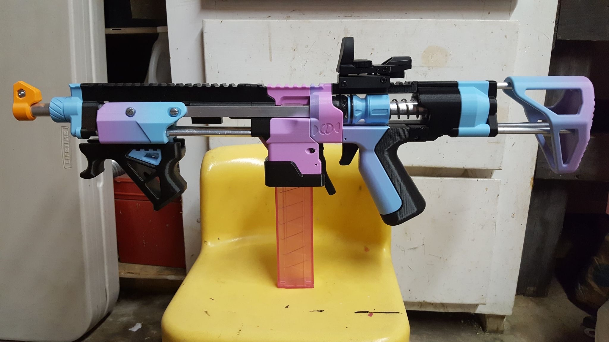
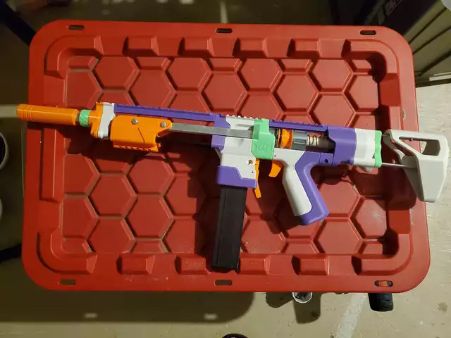
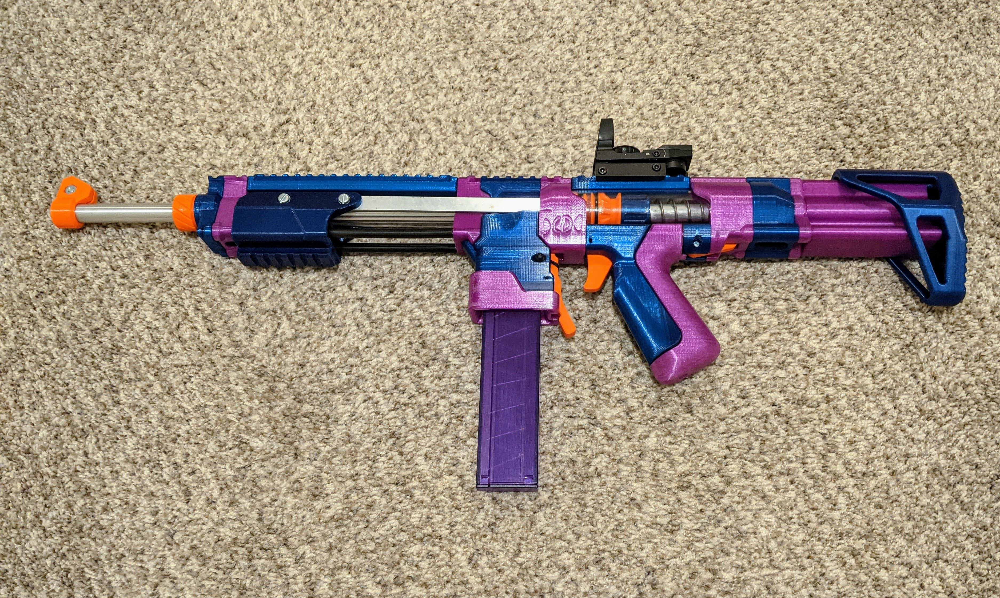
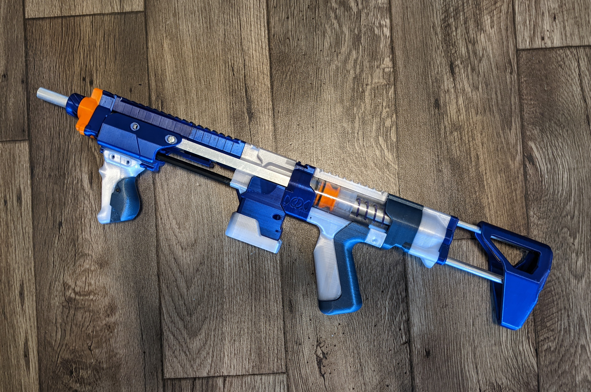
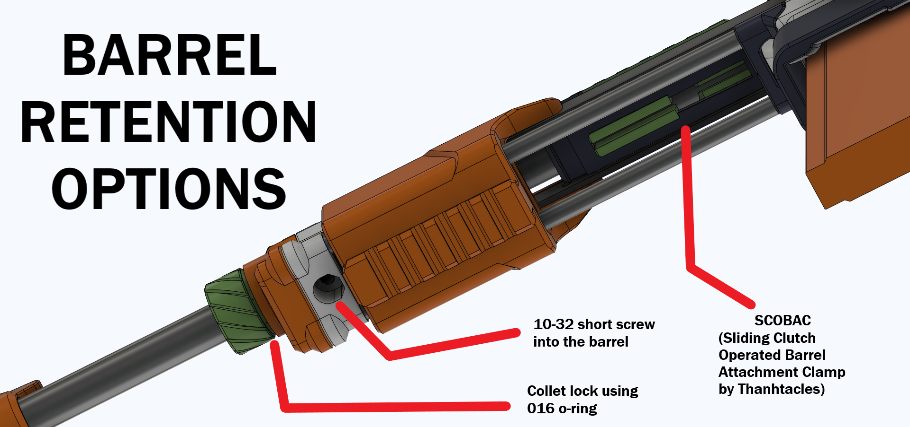
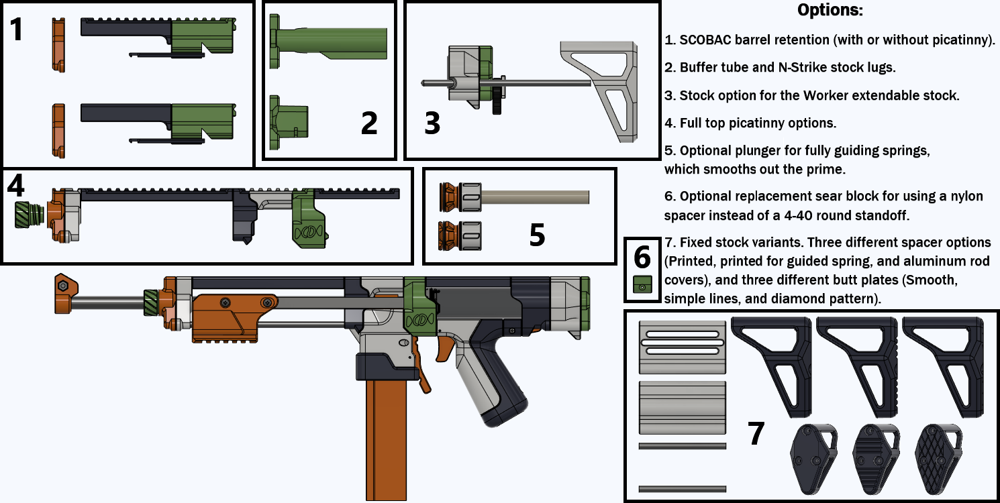

# PumpActionSkewer
A pump action version of the Charamile Designs Skewer.

- Changelog: 5-12-22: Updated design to V2, with tons of improvements. Wiped previous changelogs, as they are now non-applicable. v1 files are still available in a .zip file.
- Changelog: 5-19-22: Added a replacement Coupler for use with the extendable stock option. It is in the extendable stock folder, file name "Coupler XTND".

## Description

General blaster overview: https://www.youtube.com/watch?v=gQN2X9iRdS4

My attempt to show how smooth this blaster is: https://www.youtube.com/watch?v=RM3zugnxCN0

This is a full overhaul of the Charamile Designs Skewer, turning it into an extremely smooth, very sturdy pump action blaster.

## Reviews

Boomstick Mods: https://youtu.be/cf2TygG97xE

## "Isn't this just a Talon Claw?"

No. This blaster varies greatly from the Talon Claw. It is more similar in feel to an SBL than a TCv3.

Compared to a TCv3, the blaster is shorter in overall length, has a shorter and smoother prime, better ergonomics, a smoother magwell, and a ton of small quality of life improvements.

Also, IMO, the Pump Skewer has much sleeker aesthetics.

I personally believe that this is nicer and smoother than all the other similar blasters currently out there. It might not have all the features of those other blasters, but it is a nicer blaster as a whole. I am, of course, biased ;)

## Hardware, Compatability, and Availability

Hardware is available from these sellers:
- SilverFoxIndustries: https://silverfoxindustries.shop/collections/new-products/products/pump-action-skewer-hardware-kit

Fully printed/assembled blasters are available from these sellers:
- SilverFoxIndustries: https://silverfoxindustries.shop/products/pump-action-skewer-by-sillybutts
- SuperStressed: https://www.etsy.com/shop/SuperStressed3D

Full hardware list/BOM: https://docs.google.com/spreadsheets/d/1T-M-nh51F4b9XmtsPprrcFsghNnCDYY_msC4naolbu8/

This blaster is compatible with TCV3 rambases, TC ramrods, and TCV3 plungers. This blaster uses the same trigger, sear, and mag release as the Skewer, so any replacements for those parts should work. You can also use x-orings meant for a TC in this blaster. 

This blaster works with any TC length barrels. 

This blaster uses TC length springs, such as K25, 788, or SF25/Pro25.

## Printing Info

All STLs were exported in print orientation. F3D source files are also provided.

Infills:
Print everything small at 4 walls, 20% infill. Everything large at 4 walls, 10% infill.

## Assembly

Video: WIP

## Misc.

**If you build any of my designs, I'd love to see yours! Feel free to message me on Discord (Sillybutts#5905) or tag me on a post on Reddit (u/SillyTheGamer).**

**If you are having issues with any of my designs, let me know on Discord (Sillybutts#5905) or Reddit (u/SillyTheGamer).**

**If you wish to print and sell this item, please contact me for licensing. I can be reached on Discord (Sillybutts#5905) or Reddit (u/SillyTheGamer). We will also need to talk to Taffy.**

 This work is licensed under a <a rel="license" href="http://creativecommons.org/licenses/by-nc-sa/4.0/">Creative Commons Attribution-NonCommercial-ShareAlike 4.0 International License</a>.

## If you like what I do, please consider supporting me!

**I don't charge for my files, so any donations or merch purchases would be greatly appreciated!**

 https://www.redbubble.com/people/Sillybutts/shop RedBubble full of fun Nerf-y sticker and merch designs!  

 https://www.patreon.com/sillybutts Monthly donations

 https://www.buymeacoffee.com/sillybutts One-time donations

And here's my Etsy: https://www.etsy.com/shop/sillybuttsshop

## Images

