# PumpActionSkewer
A pump action conversion kit for the Skewer homemade Nerf blaster.

- Changelog: 9-9-21 2:42PM EST: Changed the Frail, BarrelCollet, MuzzleCap, and MuzzleBack. Frail doesn't need the nut holes that were present (leftover from the original Skewer), more tolerance for threaded rod length has been added to the muzzle bits, and the muzzles now use 2 4-40 screws to attach instead of 1. BarrelCollet has been renamed to MuzzleCapCollet to better reflect that you use one or the other, not both.

- Changelog: 9-9-21 7:50PM EST: Foregrip changed slightly to slide easier and not rub against other parts.

- Changelog: 10-8-21 9:50PM EST: Updated FrailPA to have proper pin hole depth, added picatinny rail options for FrailPA and rail_top.

- Changelog: 10-10-21 8:40PM EST: Updated ForegripPA to be fully symmetrical. Somehow, it was not the same on both sides! Just a small error I never noticed.

https://www.youtube.com/watch?v=IUbI1ZVeWzk

This kit replaces about half of the parts in the Skewer to make it pump action, like a Talon Claw. The replaced or new parts are marked in red in the third picture of this listing.

### ASSEMBLY NUT PLACEMENT PHOTOS ARE PROVIDED

The kit requires Talon Claw v3 priming bars to work. It uses the same TC Ramrod that the Skewer usually uses. It also uses TC/Caliburn rambases, and can use TCv3 plungers as well, though a Skewer-looking one is provided in this listing.

This uses 46cm threaded rods, which are longer than standard Skewer or Caliburn rods. You can find threaded rods this length at hardware stores. If they don't have 10-32 threaded rod, 10-24 + the new nuts for it, would work.

## Misc.

All STLs were exported in print orientation. STEP and F3D are also provided.

**If you are having issues with any of my designs, let me know on Discord (Sillybutts#5905) or Reddit (u/SillyTheGamer).**

**If you wish to print and sell this item, please contact me for licensing. I can be reached on Discord (Sillybutts#5905) or Reddit (u/SillyTheGamer). We will also need to talk to Taffy.**

 This work is licensed under a <a rel="license" href="http://creativecommons.org/licenses/by-nc-sa/4.0/">Creative Commons Attribution-NonCommercial-ShareAlike 4.0 International License</a>.

## If you like what I do, please consider supporting me!

**I don't charge for my files, so any donations or merch purchases would be greatly appreciated!**

- I have a RedBubble full of fun Nerf-y designs!  https://www.redbubble.com/people/Sillybutts/shop 
- I have pages on Patreon and BuyMeACoffee! 
- -  https://www.patreon.com/sillybutts 
- -  https://www.buymeacoffee.com/sillybutts 

## Images

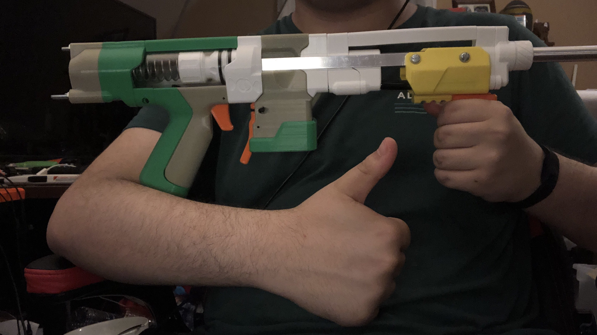

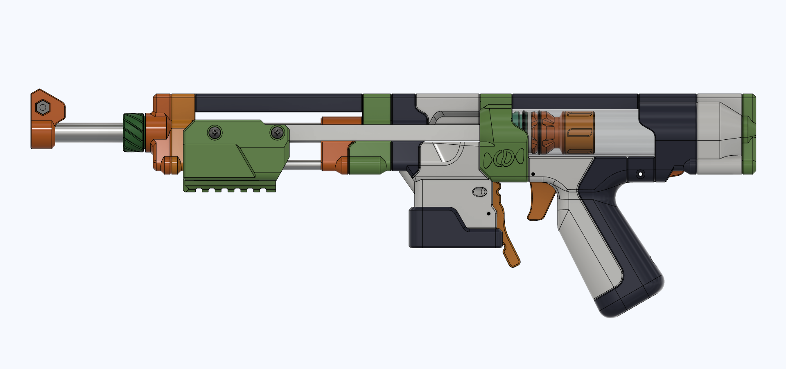

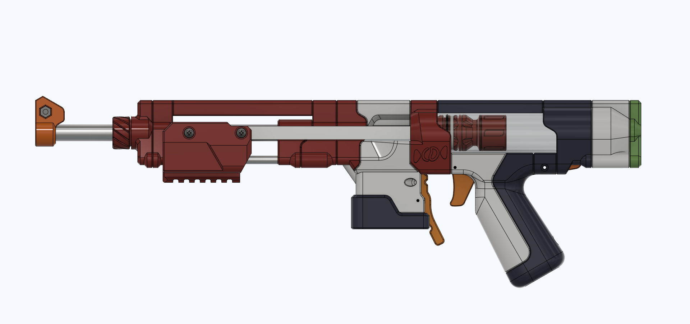

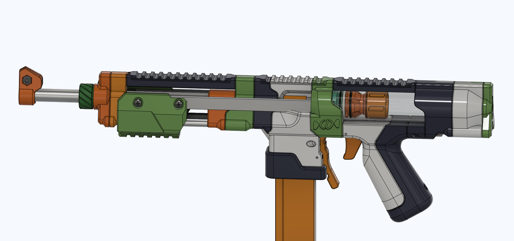

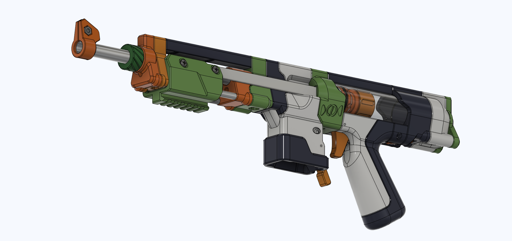

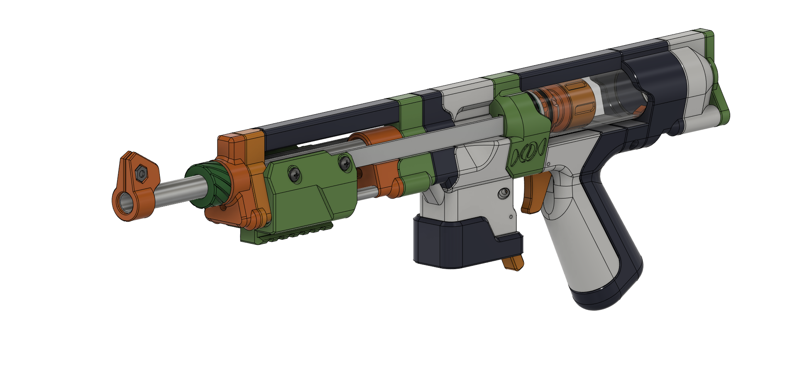

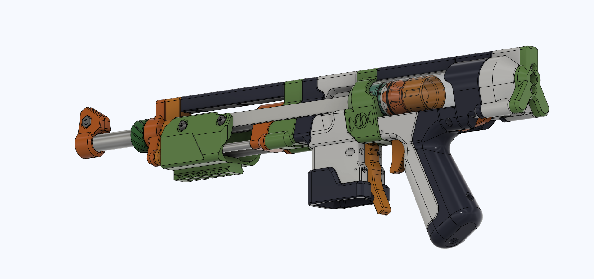

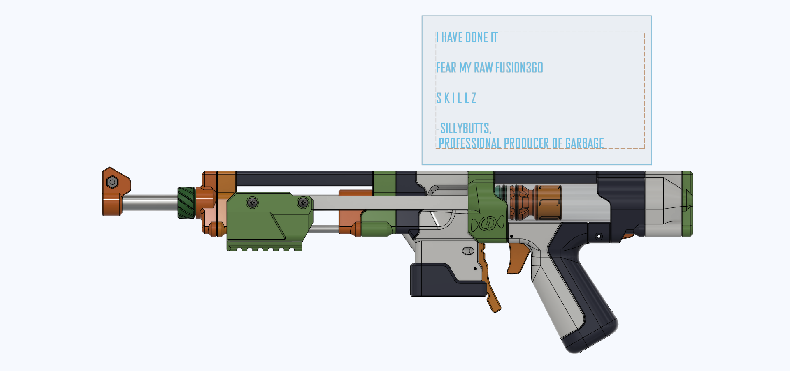

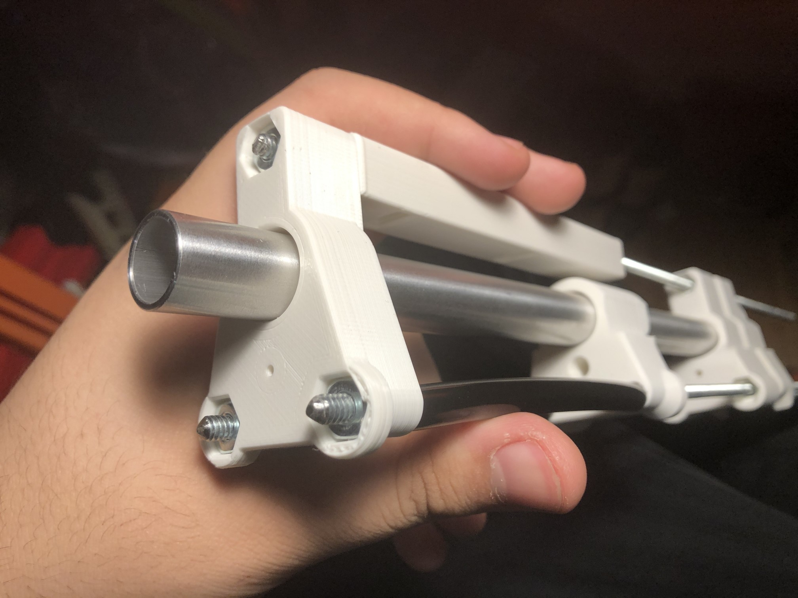

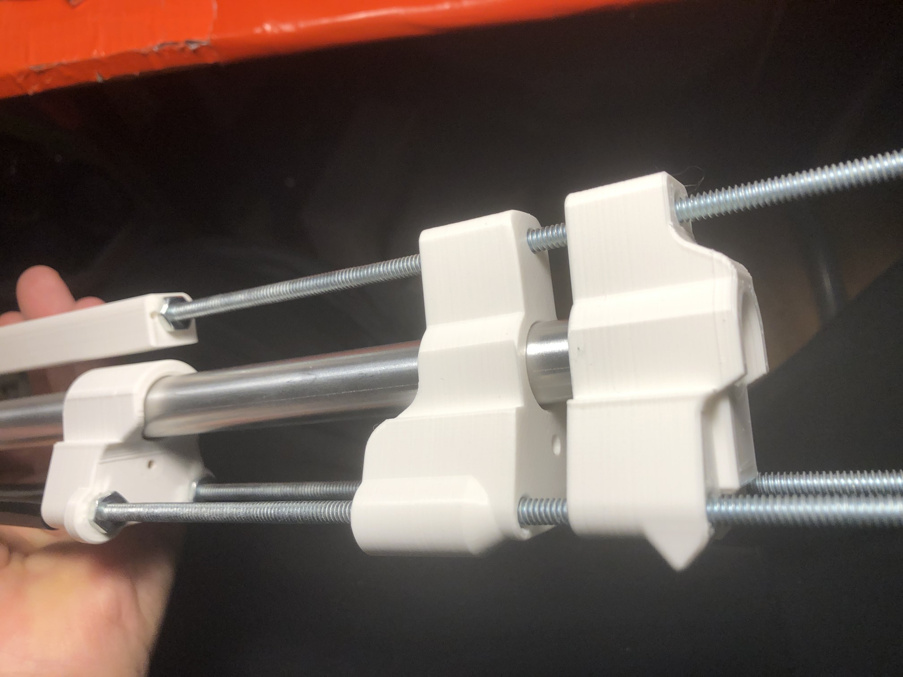

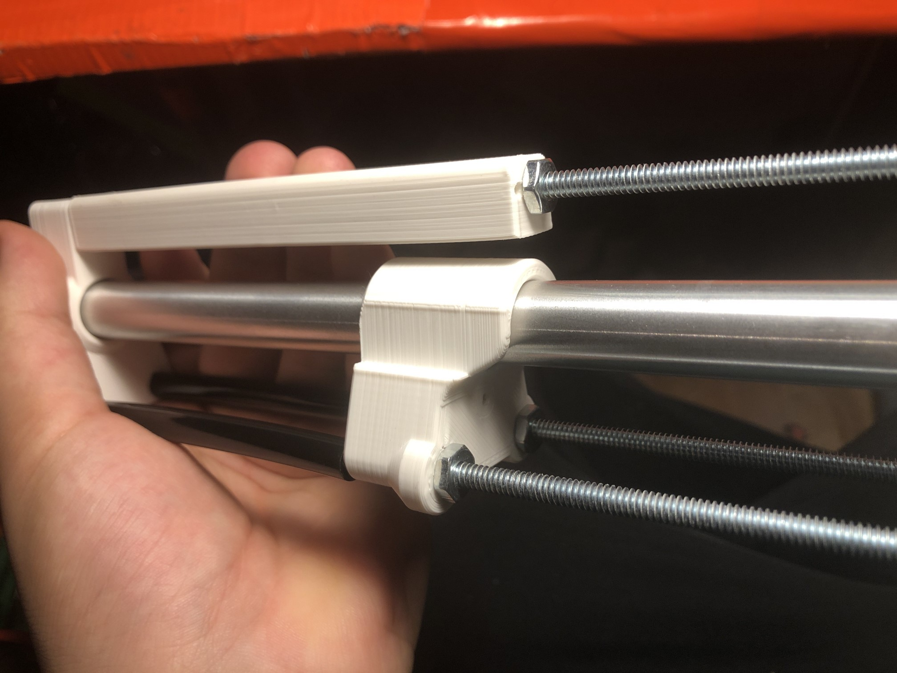

